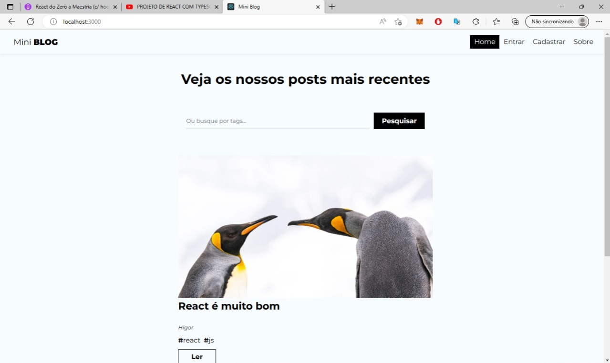
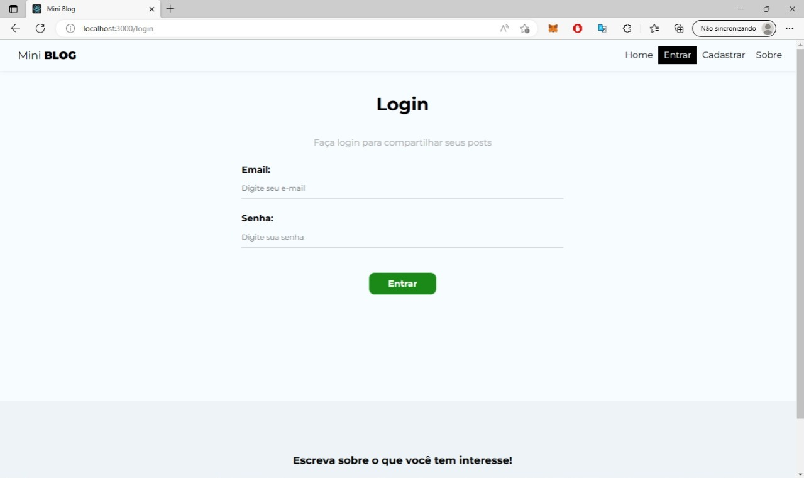
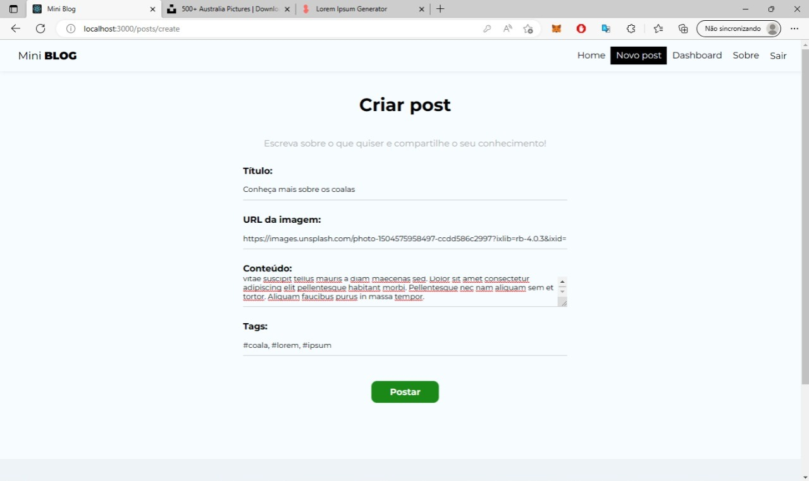
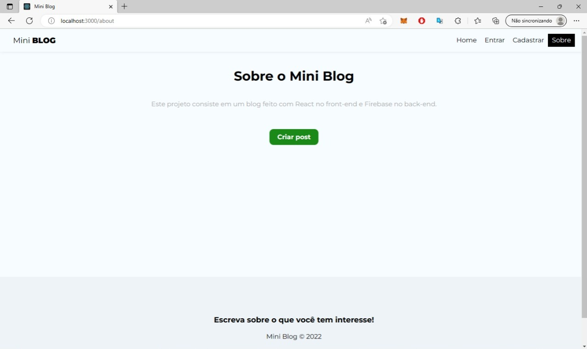
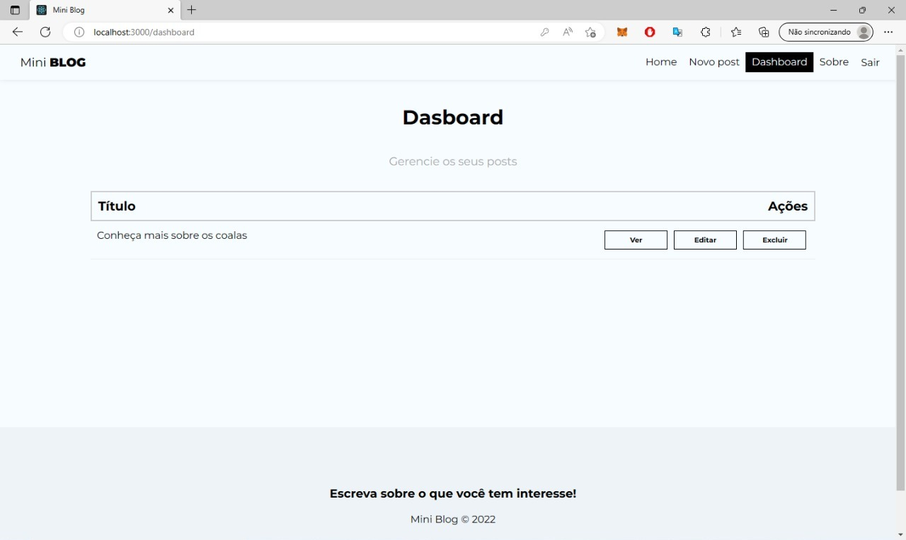
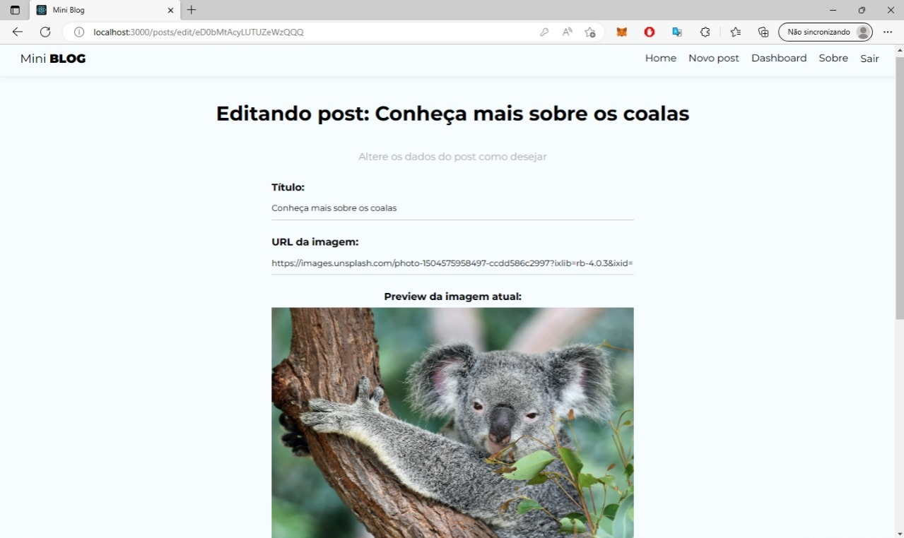
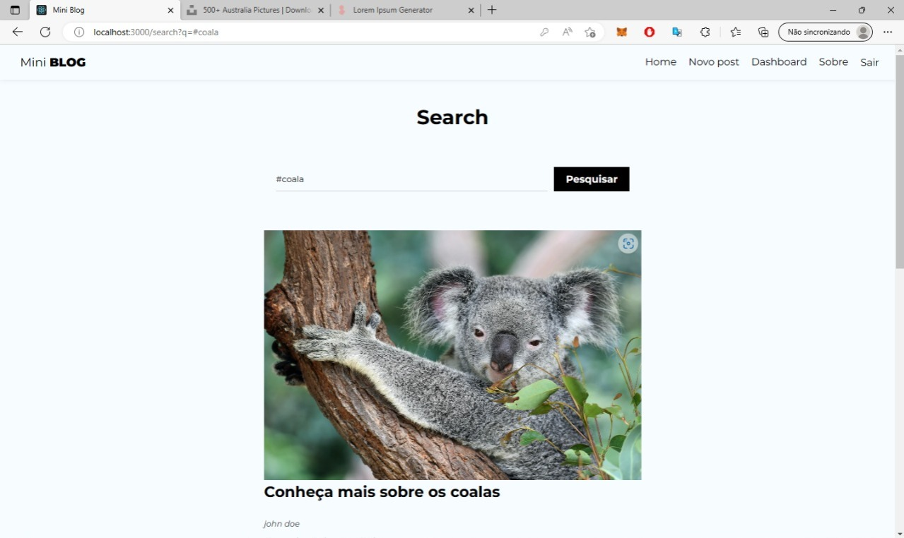

# Mini-blog

## Sobre o projeto

Uma aplicação que funciona de maneira semelhante a um blog, onde o usuário pode criar uma conta, fazer login, postar algum artigo e editar esse mesmo artigo. O projeto foi realizado visando o estudo em React e aprendendo sobre o firebase.

## Páginas da aplicação

- **Página inicial**



- **Página de login**



- **Página de cadastro**



- **Página sobre**



- **Página Criar posts**


- **Página Dashboard**



- **Página Editar Post**



- **Página Search**



## Como testar

- Crie uma conta e um banco de dadosno site do firebase, após isso você poderá configurar o arquivo ```.env``` com as seguintes chaves:

```env
REACT_APP_API_KEY=
REACT_APP_AUTH_DOMAIN=
REACT_APP_PROJECT_ID=
REACT_APP_STORAGE_BUCKET=
REACT_APP_MESSAGING_SENDER_ID=
REACT_APP_APP_ID=
```

- Utilize o comando ```npm install``` para instalar as depêndencias;

- Então utilize o comando ```npm start``` para iniciar a aplicação e poder abrir o link gerado no navegador.
